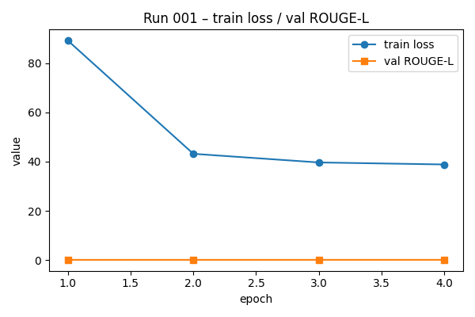
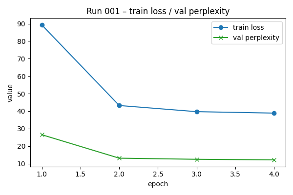

# Состав репозитория

- data_utils.py - обработка данных
- lstm_model.py - LSTM модель
- train_lstm.py - обучение и оценка LSTM
- inference_lstm.py - автогенерация текста с LSTM
- inference_transformer.py -  автогенерация текста с трансформером
- common.py - общие функции
- compare.py - сравнение моделей
- solution.ipynb - jupyter notebook в котром весь код
- models - в директории находится чекпоинт с лучшими весами, а также полная лучшая модель (после обучения на VM с GPU)

# Вычислительный эксперимент

Тренировка выполнялась на датасете размером 300k твитов. Пробовал полный сет, но работало очень долго.

Метрики:

# Avg. ROUGE-L

|LSTM Greedy|Transformer Greedy|LSTM Sampling|Transformer Sampling|
|:-:|:-:|:-:|:-:|
|0.070653|0.051920|0.071244|0.049679|
|Запись|Запись|Запись|Запись|

# LSTM жадная генерация
PROMT: - awww, that's a bummer. you shoulda g
PREDICTION: - awww, that's a bummer. you shoulda gd you!!!!!!!!!!!!!!!!!!

PROMT: is upset that he can't update his facebook by texting 
PREDICTION: is upset that he can't update his facebook by texting !!!!!!!!!!!!!!!!!!!!!!

PROMT: i dived many times for the ball. manage
PREDICTION: i dived many times for the ball. manage to get a new one.!!!!!!!!!!!!!!

PROMT: my whole body feels itc
PREDICTION: my whole body feels itc!!!!!!!!!!!!!!!!!!!!

PROMT: no, it's not behaving at all. i'm mad. why am 
PREDICTION: no, it's not behaving at all. i'm mad. why am ive been up since 4am and i'm so tired!!!!!!!!!

# TRANSFORMER жадная генерация
TRANSFORMER жадная генерация:
PROMT: - awww, that's a bummer. you shoulda g
PREDICTION: osh, but I'm not going to be able to do that. I'm going to be able

PROMT: is upset that he can't update his facebook by texting i
PREDICTION: Message.

PROMT: i dived many times for the ball. manage
PREDICTION:  to get the ball out of the box.

PROMT: my whole body feels itc
PREDICTION: oughing.”

PROMT: no, it's not behaving at all. i'm mad. why am 
PREDICTION: ive seen this?

I'm not sure if it's a good idea to just sa

# LSTM с семплированием
PROMT: - awww, that's a bummer. you shoulda g
PREDICTION: - awww, that's a bummer. you shoulda give emic was great.!!!! makes me cry!!!!!!.

PROMT: is upset that he can't update his facebook by texting 
PREDICTION: is upset that he can't update his facebook by texting iphone!!!! no more red.!!!!!!!!!!

PROMT: i dived many times for the ball. manage
PREDICTION: i dived many times for the ball. manage to do some more than the other work!! my mouth is killing me.!!x.

PROMT: my whole body feels itc
PREDICTION: my whole body feels itc! and my best friends and im almost over!!!!!!!!!!!

PROMT: no, it's not behaving at all. i'm mad. why am 
PREDICTION: no, it's not behaving at all. i'm mad. why am ??????!!! i can't see you tomorrow..! &lt;3!&lt

# TRANSFORMER с семплированием

TRANSFORMER с семплированием:
PROMT: - awww, that's a bummer. you shoulda g
PREDICTION: ee at the idea of a c-section. so you can get a feel for how the c

PROMT: is upset that he can't update his facebook by texting i
PREDICTION: Message

PROMT: i dived many times for the ball. manage
PREDICTION:  to keep his composure with the ball and still keep his composure with the ball.

PROMT: my whole body feels itc
PREDICTION: oughing at the time of writing.
The feeling that I feel is as though I can never

PROMT: no, it's not behaving at all. i'm mad. why am 
PREDICTION: ive seen my wife being harassed by a man who I like to call "em, I'm mad

# Что лучше использовать

Судя по метрикам, обученная модель LSTM лучше справляется задачей как на жадной генерации, так и при семплировании. Если посмотреть на сами сгенерованные тексты, то трансформер может добавлять неуместные переносы строк в больших количествах, что совсем не характерно для твитов.

Вывод: для автогенерации твитов обученная LSTM работает лучше чем трансформер distilbert (без дообучения).

# Тест репозитория

Создаем окружение:

`python3 -m venv .venv`
 
Активируем:

`source .venv/bin/activate`

Устанавливаем зависимости: 

`pip install -r requirements.txt`

## Сравнение моделей

Переходим в ./src

Запускаем сравнение:

`python3 compare.py`

## Запуск обучения

Чтобы запустить обучение, запустите модуль train_lstm.py:

Запускаем обучение:

`python3 train_lstm.py`

Если у вас определится cuda, то обучение будет на всем датасете, иначе - на выборке из 50 элементов. Артефакты обучения
будут сохранены в **models**. 

Внимание: Если запустить обучение, то мои чекпоинты пересоздадутся!